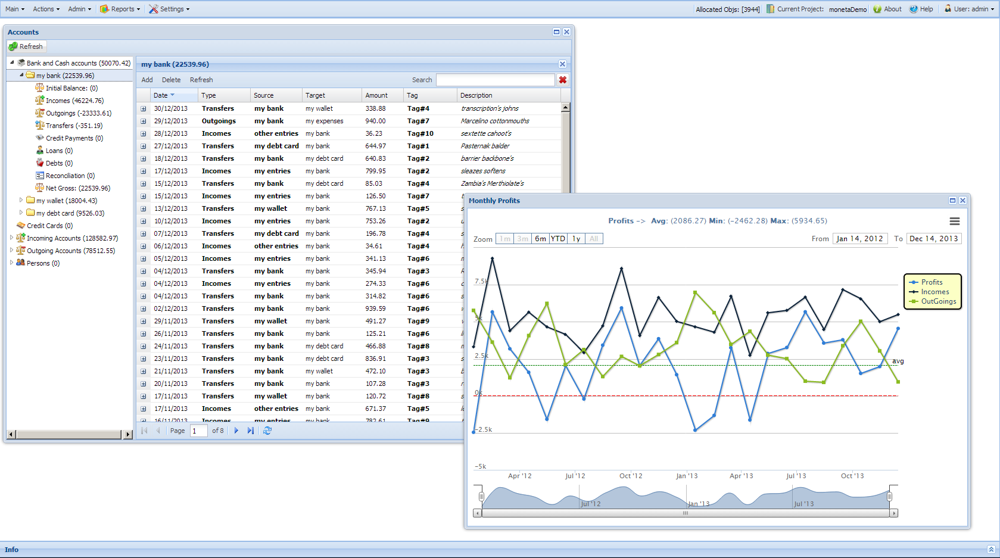

# Moneta - Ext-JS based standalone Web application for personal accounting

Moneta is a web based graphical accouting software written in ExtJS and uses MySQL as database backend.

Moneta is licensed under GNU GENERAL PUBLIC LICENSE, Version 3.0
http://gplv3.fsf.org/

## Main Features
- Open Source
- Window based GUI
- Easy installation: no setup required
- Works on local apache server so data is locally maintained
- Tracks multiple activities: incomes/outgoings/transfers/credit card payments/loans/debts
- Chart based reports including timeseries and multiple format exports (png/pdf,jpeg...)
- Tag on activities
- Flexible grouping on activities reports on date/tag/source....
- Support for multiple users, projects and permissions

## Installation instructions
A brief guide can be found at:
http://strollo.github.io/moneta/

Alternatively if you want to run on Windows or to skip installation steps, it can be run in a docker container by following the instructions at:

https://github.com/strollo/monetadock

A DEMO can be found at:

*** UPS SORRY CLOUDATCOST REMOVED MY (free forever, but not for ever) ACCOUNT ***

So it will be back available ASAP on other bays...

And enjoy ;)
